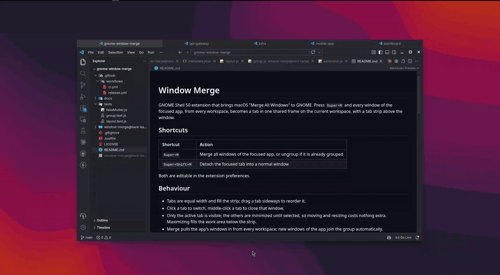

# Window Merge

GNOME Shell extension (GNOME 50 and newer) that brings macOS "Merge All Windows" to GNOME.
Press `Super+M` and every window of the focused app, from every workspace,
becomes a tab in one shared frame on the current workspace, with a tab strip
above the window.

## Shortcuts

| Shortcut | Action |
|---|---|
| `Super+M` | Merge all windows of the focused app, or ungroup if it is already grouped |
| `Super+Shift+M` | Detach the focused tab into a normal window |

Both are editable in the extension preferences.

## Behaviour

- Click a tab to switch, drag it sideways to reorder, middle-click to close that window.
- Merge pulls the app's windows in from every workspace; new windows of the app join the group automatically.
- Alt+Tab and the overview keep showing every window.

## Install

### From a release zip

Download `window-merge@berk-karaal.zip` from the
[latest release](https://github.com/berk-karaal/gnome-window-merge/releases/latest),
then:

    gnome-extensions install --force window-merge@berk-karaal.zip

Log out and back in (Wayland loads extensions at login), then:

    gnome-extensions enable window-merge@berk-karaal

### From source

    git clone https://github.com/berk-karaal/gnome-window-merge.git
    cd gnome-window-merge
    just install

Then log out and back in and run `gnome-extensions enable window-merge@berk-karaal`.

### Update

Same steps as install, then log out and back in.

## Develop

    just test     # unit tests (gjs)
    just check    # syntax-check all modules
    just nested   # install and run a nested shell for trying changes
    just zip      # build the extensions.gnome.org upload bundle
    just lint     # run shexli, the extensions.gnome.org analyzer, on the bundle

## Release

CI runs the checks and tests on every push. Pushing a tag such as `v1.0`
runs them again, builds the zip and creates a GitHub Release with it attached;
upload that zip to https://extensions.gnome.org/upload/ by hand.

## License

GPL-2.0-or-later. See `LICENSE`.
